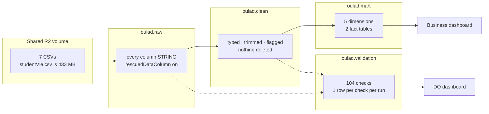

# OULAD Pipeline

A raw → clean → mart pipeline over the **Open University Learning Analytics Dataset**,
built in Databricks on Unity Catalog, with data quality checks at every layer and two
dashboards on top.

| | |
|---|---|
| **Catalog** | `oulad` |
| **Layers** | `raw` → `clean` → `mart`, with `validation` alongside |
| **Scale** | 32,593 enrolments · 28,785 students · 22 module presentations · 10.6M clickstream rows |
| **Checks** | 104 across 7 tables · last run 76 PASS / 13 WARN / 0 FAIL on the 89 verified |
| **Updated** | 11 September 2026 |

---

## The questions this answers

| | Question | Answered from |
|---|---|---|
| **Q1** | How does student engagement relate to performance? | `fact_vle_interactions` × `fact_assessments` × `dim_student` |
| **Q2** | What patterns appear among students who withdraw? | `dim_demographics`, `student_registration`, `student_info` |
| **Q3** | How does student activity change through the course? | `fact_vle_interactions` × `dim_date` |
| **Bonus** | Can we flag at-risk students *before* the course starts? | day-zero columns only, no clicks, no scores |

---

## Pipeline



Raw lands as STRING on purpose. If raw types a column at read time, a value that will
not cast becomes NULL at ingest, before anything can see it, and every schema check
downstream reports zero failures forever. They are not passing, they are blind.

---

## Quick start

```sql
-- 1. once
src/sql/00_setup/00_setup.sql

-- 2. ingest, any order  ⚠️ edit the volume name first, see below
src/sql/01_raw/*.sql

-- 3. clean, any order, after raw
src/sql/02_clean/*.sql

-- 4. profile, then validate
src/sql/05_validation/01_profile_source_data.sql
src/sql/05_validation/02_validate_staging.sql     -- §00 once, then §01-07 any order

-- 5. build the star, after validation comes back clean
src/sql/03_mart/*.sql
```

> [!IMPORTANT]
> **The volume name is per person.** The shared folder is the same for everyone, the
> volume that exposes it is not. Change it in `01_raw/` before your first run:
> `/Volumes/workspace/default/<your-volume>/shared/week07/`
>
> There is no `oulad/` subfolder, whatever the brief says. Copying a teammate's path
> verbatim gives you `NO_SUCH_CATALOG` before you write a line of SQL.

> [!NOTE]
> **Load every table, not just your own.** The validation step reads across tables for
> referential integrity and volume. On a partial workspace, the checks that matter most
> are exactly the ones that will not run.

---

## Repo layout

```
src/sql/
├── 00_setup/              catalog and schemas
├── 01_raw/                7 ingest scripts, one per CSV
├── 02_clean/              7 cleaning scripts, one per table
├── 03_mart/               5 dimensions + 2 facts
├── 04_bi_visualization/   business dashboard queries
├── 05_validation/         profiling + data quality checks
├── 06_dq_visualization/   DQ dashboard queries
└── 07_testing_sandbox/    per-person scratch, nothing here is read by the pipeline
docs/                      this documentation
assets/images/             star schema diagram
```

---

## Documentation

| Document | What is in it |
|---|---|
| [architecture.md](docs/architecture.md) | Layers, catalog layout, the rules at each layer, run order, branching |
| [data-model.md](docs/data-model.md) | Star schema, grain statements, keys, the two fanout traps |
| [dictionary.md](docs/dictionary.md) | Every column of every clean table, with measured distributions |
| [decisions.md](docs/decisions.md) | What we chose, what we rejected, and what would change our minds |
| [validation.md](docs/validation.md) | The 104 checks, the status rule, and the last measured run |

---

## Team

| Area | Person | GitHub |
|---|---|---|
| Model, grain and keys, `courses` | Garet | [@annmargarettel](https://github.com/annmargarettel) |
| `student_info`, documentation | Kinah | [@czekinah](https://github.com/czekinah) |
| Profiling, DQ sources and intermediate, `vle` | Anje | [@anjelikamarquez](https://github.com/anjelikamarquez) |
| DQ staging and marts, `assessments`, `student_assessment` | Mia | [@miabarroga-de](https://github.com/miabarroga-de) |
| Business dashboard, DQ dashboard, `student_registration` | Charlene | [@ocharlenemae](https://github.com/ocharlenemae) |
| Gold, `student_vle` | Crizza | [@cricraps](https://github.com/cricraps) |

---

## Three things a new reader should know

> [!WARNING]
> **A null check on these files returns zero and is lying.**
> Every missing value in all seven CSVs is the literal string `?`, never an empty field.
> 22,521 of them in one column alone. A completeness check written the obvious way
> passes and ships sentinel values into the mart.

> [!NOTE]
> **Nothing is deleted, with one exception.**
> Rows in equals rows out at every layer, proven by a volume check on every table every
> run. Problems are flagged and counted, and the mart filters on the flag. The exception
> is `student_vle`, which aggregates and then filters — see
> [decisions.md](docs/decisions.md) D19 and O11.

> [!TIP]
> **The grain sentence decides everything.**
> `student_info` is one row per student **per module presentation**, not one row per
> student. 32,593 rows hold 28,785 people. Getting that written down first is what
> caught the `dim_student` fanout that would have doubled every click for 72 students,
> silently, with no error anywhere.

---

## Status

| Layer | State |
|---|---|
| Raw | 7 of 7 |
| Clean | 7 of 7 |
| Mart | 5 dimensions + 2 facts present |
| Validation | profiling + 104 staging checks + intermediate notebook |
| Dashboards | DQ dashboard built, business dashboard in progress |
| Docs | this set |

Open questions are tracked at the bottom of [decisions.md](docs/decisions.md).
