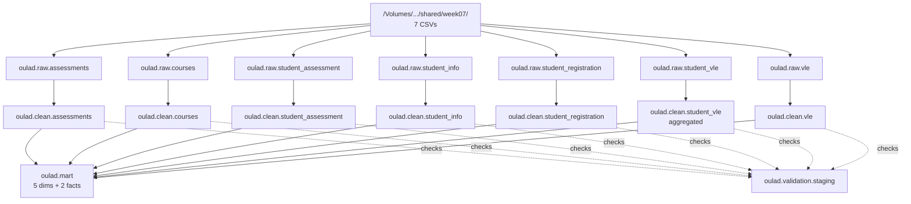
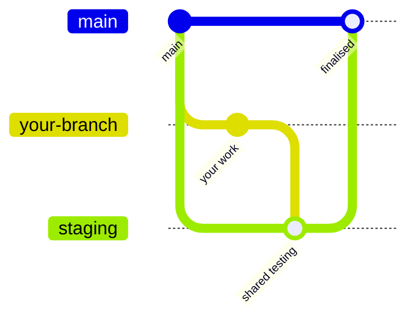

# Architecture

Layers, catalog layout, the rule at each layer, run order and branching.

- [The shape of it](#the-shape-of-it)
- [Catalog and schemas](#catalog-and-schemas)
- [Raw: change nothing](#raw-change-nothing)
- [Clean: cast, trim, normalise, keep every row](#clean-cast-trim-normalise-keep-every-row)
- [Validation: one results table](#validation-one-results-table)
- [Run order](#run-order)
- [Branching](#branching)
- [Code comments](#code-comments)
- [The environment gotcha](#the-environment-gotcha)

---

## The shape of it



---

## Catalog and schemas

One catalog, `oulad`, created by `src/sql/00_setup/00_setup.sql`.

| Schema | Holds | Written by |
|---|---|---|
| `oulad.raw` | the seven CSVs as ingested, every column STRING | `01_raw/` |
| `oulad.clean` | the seven cleaned, typed tables | `02_clean/` |
| `oulad.mart` | dimensions and facts | `03_mart/` |
| `oulad.validation` | check results, one row per check per run | `05_validation/` |
| `oulad.bi_visualization` | business dashboard datasets | `04_bi_visualization/` |
| `oulad.dq_visualization` | DQ dashboard datasets | `06_dq_visualization/` |

The lecture calls the layers raw, clean and mart. Some of our notes say bronze, silver
and gold. Same three layers, same rules. The code uses the schema names above; treat
bronze/silver/gold as conversation only.

**Table names carry no layer prefix.** `oulad.clean.assessments`, not
`oulad.clean.clean_assessments`. The schema already says which layer you are in, and
`03_mart/` follows the same rule with `dim_student` rather than `mart_dim_student`.
See [decisions.md](decisions.md) D11.

---

## Raw: change nothing

Every column lands as STRING, deliberately, with `inferSchema => 'false'` and
`rescuedDataColumn => '_rescued_data'`.

> [!IMPORTANT]
> This is the least obvious decision in the pipeline and the one most worth
> understanding. If raw types a column at read time, a value that will not cast becomes
> NULL **at ingest**, before anything can see it. The clean layer then finds a tidy NULL,
> and the schema checks in `05_validation` report zero failures forever. They are not
> passing, they are blind.
>
> With STRING raw, a bad value arrives intact, `TRY_CAST` in the clean layer turns it
> into a NULL that gets counted, and the check actually fires.

Lineage columns are added. Nothing else is altered:

| Column | Meaning |
|---|---|
| `_source_file` | the file the row was read from |
| `_source_modified_at` | when that file last changed |
| `_ingested_at` | when raw read it |
| `_rescued_data` | anything the parser could not place. **Must be empty.** |

---

## Clean: cast, trim, normalise, keep every row

Seven rules, applied identically to all seven tables.

### 1. Flag, never delete

Rows in equals rows out. Nothing is dropped, quarantined or filtered.

> [!WARNING]
> `student_vle` is the exception, and it is a deliberate one that has not been fully
> settled. It aggregates with `GROUP BY`, so clean holds fewer rows than raw, and
> `student_vle_final` additionally filters `WHERE sum_click <= 5000`. See
> [decisions.md](decisions.md) D19 and O11.

### 2. `TRY_CAST`, never bare `CAST`

A value that will not cast becomes a NULL the checks can count, not an error that kills
the load. This was reviewed and confirmed on 11 Sep — see [decisions.md](decisions.md) M1.

### 3. `?` is the missing value, everywhere in this dataset

Verified against the files, not assumed:

| Column | `?` rows |
|---|---|
| `student_registration.date_unregistration` | 22,521 |
| `vle.week_from`, `vle.week_to` | 5,243 each |
| `student_info.imd_band` | 1,111 |
| `student_assessment.score` | 173 |
| `student_registration.date_registration` | 45 |
| `assessments.date` | 11 |

Every column that can be missing is wrapped in `NULLIF(NULLIF(TRIM(col), ''), '?')`.

`TRY_CAST` would turn `?` into NULL on its own, which is why this went unnoticed for
weeks. But the validation layer has to know which NULLs were sentinels, or it counts
them as cast failures: without the wrapper, `student_registration` alone reports
**22,560 failures on a perfectly clean load**.

### 4. Trim everything

`UPPER` on `code_module` and `code_presentation`, `LOWER` on `activity_type`, source
casing preserved everywhere else.

### 5. A bad value is kept, not nulled

> [!CAUTION]
> If you map an unrecognised value to NULL to be tidy, the accepted-values check
> downstream counts zero failures and reports PASS permanently. The bad value did not
> go away, it stopped being visible. Three separate cleaning scripts were doing this.

### 6. One type per concept, across all seven tables

So no join needs a cast.

| Concept | Type |
|---|---|
| `id_student`, `id_assessment`, `id_site` | INT |
| day and week offsets | INT |
| `sum_click`, `num_of_prev_attempts`, `studied_credits`, `module_presentation_length` | INT |
| `score`, `weight` | DOUBLE |
| `is_banked` | INT, 0 or 1 |

### 7. Lineage

`_cleaned_at` on every table. File-level lineage stays in raw, which is where you would
look for it.

---

## Validation: one results table

All clean-layer checks write to `oulad.validation.staging`. The name follows this repo's
convention, where "staging" means the clean layer, so the siblings are
`oulad.validation.intermediate` and `.marts`, matching the files in `05_validation/`.

Each section deletes only its own rows and re-inserts:

```sql
DELETE FROM oulad.validation.staging WHERE table_name = 'student_info';
INSERT INTO oulad.validation.staging ...
```

> [!CAUTION]
> Never `TRUNCATE`. On a shared table that erases the other six owners' results, and
> whoever ran last would be the only table with any.

Because each owner touches only their own `table_name`, the seven sections run in any
order, by different people, on different days, with no coordination.

Full detail in [validation.md](validation.md).

---

## Run order

| Step | What | Depends on |
|---|---|---|
| 1 | `00_setup/00_setup.sql` | nothing, run once |
| 2 | `01_raw/*` | the volume being mounted |
| 3 | `02_clean/*` | its own raw table only |
| 4 | `05_validation/01_profile_source_data.sql` | raw |
| 5 | `05_validation/02_validate_staging.sql` §00 | run once |
| 6 | `05_validation/02_validate_staging.sql` §01-07 | **all** clean tables |
| 7 | `03_mart/*` | validation coming back clean |
| 8 | `05_validation/03_validate_intermediate.ipynb` | the mart |

No clean script reads another clean table, so step 3 parallelises freely. Step 6 reads
across tables for referential integrity, which is why all of step 3 has to finish first.

### Everyone loads every table

Step 6 cannot run on a partial workspace. This stopped the validation run in the 11 Sep
session outright. Each person loads all seven raw and all seven clean tables in their own
workspace, whichever table they personally own.

---

## Branching



`main` is the clean slate: finalised code only. `staging` is where finished work from
several people is merged and tested together.

> [!IMPORTANT]
> **Pull from `main`, not from `staging`.** Pulling from `staging` brings down everyone's
> in-progress drafts, and those drafts are then sitting in your branch when you push,
> which is what caused the merge conflicts on 11 Sep.

Renaming a file reflects on the branch you are working in. Other branches see the new
name only once they pull from main.

---

## Code comments

Comments explain **what** a block does, in a line or two, so someone reading the script
can follow it.

Reasoning, design rationale and overviews are documentation, and belong in `docs/`. The
exception is a comment that exists to stop someone reintroducing a bug, such as the
NULL-safety note above `INF_20`, which stays where the trap is.

Notebooks handle this better than flat `.sql` files: one cell per script, markdown cells
for commentary, and a failure that points at the cell rather than the file.
`03_validate_intermediate.ipynb` is the first one. See [decisions.md](decisions.md) M2
and M3.

---

## The environment gotcha

The volume name is per person. The folder is shared, the volume that exposes it is not:
`/Volumes/workspace/default/<your-volume>/shared/week07/`

Verified contents:

| File | Size | Rows |
|---|---|---|
| `assessments.csv` | 8 KB | 206 |
| `courses.csv` | 526 B | 22 |
| `studentAssessment.csv` | 5.4 MB | 173,912 |
| `studentInfo.csv` | 3.3 MB | 32,593 |
| `studentRegistration.csv` | 1.1 MB | 32,593 |
| `studentVle.csv` | 433 MB | ~10.6 M |
| `vle.csv` | 264 KB | 6,364 |
| `OULAD.txt` | 12 KB | the source's own readme |

File names are case sensitive. All row counts except `studentVle.csv` were counted from
the files directly.
