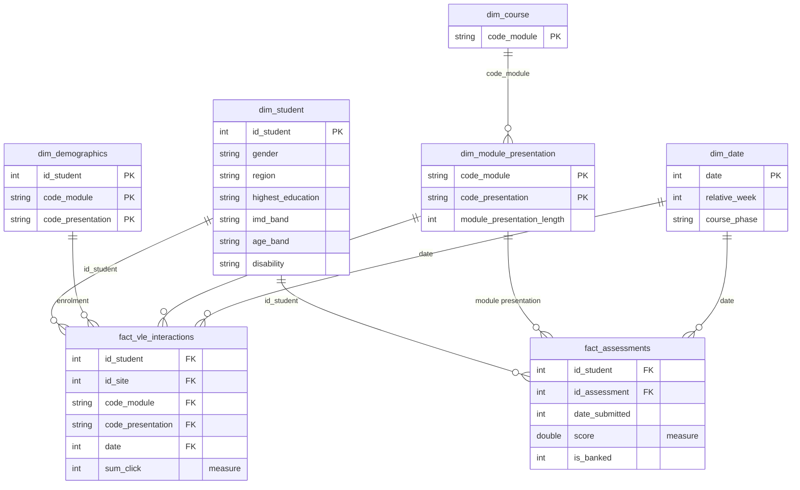

# Data model

Star schema, grain statements, keys, and the two traps that silently inflate totals.

- [The star](#the-star)
- [Grain statements](#grain-statements)
- [Keys](#keys)
- [Trap 1: the student_vle duplicate grain](#trap-1-the-student_vle-duplicate-grain)
- [Trap 2: the dim_student fanout](#trap-2-the-dim_student-fanout)
- [What dim_student deliberately does not carry](#what-dim_student-deliberately-does-not-carry)
- [Referential integrity](#referential-integrity)
- [PII](#pii)

---

## The star

Two fact tables, because there are two measures at two different grains. Forcing both
into one table multiplies clicks by assessments and inflates every total.



`03_mart/` holds exactly these seven objects:

| File | Object | Owner |
|---|---|---|
| `01_dim_student.sql` | `dim_student` | Garet |
| `02_dim_demographics.sql` | `dim_demographics` | Garet |
| `03_dim_course.sql` | `dim_course` | Garet |
| `04_dim_module_presentation.sql` | `dim_module_presentation` | Garet |
| `05_dim_date.sql` | `dim_date` | Garet |
| `06_fact_vle_interactions.sql` | `fact_vle_interactions` | Crizza |
| `07_fact_assessments.sql` | `fact_assessments` | Mia |

> [!NOTE]
> An earlier draft of the model listed `dim_vle`, `dim_assessment` and
> `dim_registration`. They have no files and are not built. `vle` attributes reach the
> star through `id_site` on the fact, and registration dates through `student_info`.

---

## Grain statements

Write the grain down before writing the SQL. Both traps below were caught by someone
stating the grain out loud first.

| Table | One row is |
|---|---|
| `clean.assessments` | one assessment in one module presentation |
| `clean.courses` | one module presentation |
| `clean.student_assessment` | one student's submission for one assessment |
| `clean.student_info` | one student **enrolment in one module presentation**, not one student |
| `clean.student_registration` | one student's registration in one module presentation |
| `clean.student_vle` | one student, one resource, one day — **after aggregation** |
| `clean.vle` | one VLE resource |

---

## Keys

A primary key makes a row unique. In most of these tables no single column does, so the
key is composite.

| Table | Natural key | Holds? |
|---|---|---|
| `assessments` | `id_assessment` | yes, 206 of 206 |
| `courses` | `code_module, code_presentation` | yes, 22 pairs |
| `vle` | `id_site` | yes, 6,364 of 6,364 |
| `student_info` | `code_module, code_presentation, id_student` | yes, 32,593 of 32,593 |
| `student_registration` | `code_module, code_presentation, id_student` | yes |
| `student_assessment` | `id_student, id_assessment` | yes |
| `student_vle` | `id_student, id_site, code_module, code_presentation, date` | yes in clean, **no in raw** |

The test, on every table, every time: **row count must equal the distinct count of the
key.** That is one check per table in `05_validation`.

`student_info` also carries `enrolment_key`, an MD5 over its three-part key, so a
downstream table can reference one column instead of three.

---

## Trap 1: the student_vle duplicate grain

> [!WARNING]
> The raw file does not have the grain the model assumes. Measured on a 588,132-row
> sample of the real `studentVle.csv`:
>
> | | |
> |---|---|
> | rows sampled | 588,132 |
> | distinct student/site/module/presentation/date keys | 447,708 |
> | rows repeating an existing key | **140,424 (23.88%)** |
> | most rows on a single key | 7 |

`06_clean_student_vle.sql` resolves this by aggregating in the clean layer:

```sql
CREATE OR REPLACE TABLE oulad.clean.student_vle AS
SELECT code_module, code_presentation, id_student, id_site, date,
       SUM(sum_click) AS sum_click,
       COUNT(*)       AS original_record_count
FROM oulad.raw.student_vle
GROUP BY code_module, code_presentation, id_student, id_site, date;
```

Keeping `original_record_count` is the right instinct: the evidence of the collapse
survives into the clean table instead of vanishing.

Build the fact table off the **un**aggregated raw and every per-day click figure splits
across several rows, so any `COUNT(*)` of interactions is roughly 31% too high and any
join to it fans out. Nothing raises an error. The totals are just wrong.

### What this costs

Aggregating in clean breaks "rows in equals rows out" for this one table. Three
consequences, all of them recorded rather than resolved:

1. **`SVL_15` will FAIL every run.** It compares raw row count to clean row count, and
   clean now holds fewer rows on purpose. It will be the only FAIL in the whole set.
2. **`SVL_11` reads 0 forever.** It counts duplicate grain keys on the clean table, which
   the `GROUP BY` has already deduplicated, so it reports PASS whatever the source does.
   Its expectation text still says "mart must aggregate", which stopped being true when
   the clean layer took that job.
3. **`student_vle_final` deletes rows.** It filters `WHERE sum_click <= 5000`, which is
   the one place in the pipeline that breaks flag-never-delete.

See [decisions.md](decisions.md#open) O11 and O13. Neither has been changed in the code.

### A note on the explanation offered

It was suggested that repeats are fine as long as the **site and activity type differ**,
because a student accesses several resources in a day. True, and the right instinct, but
it does not account for the measurement: the test **already includes `id_site`**, and
`activity_type` lives on `vle`, not `student_vle`, where it is a property of `id_site`
and so carries no information the key does not already have. The repeats are the same
student touching the same resource on the same day, up to 7 times.

---

## Trap 2: the dim_student fanout

`dim_student` must be one row per student. `student_info` is one row per enrolment. The
obvious bridge is `SELECT DISTINCT` on the demographic columns, and it fails quietly.

| | Rows |
|---|---|
| `SELECT DISTINCT id_student, gender, region, highest_education, imd_band, age_band, disability` | 28,857 |
| distinct `id_student` in that result | 28,785 |
| **duplicate student keys** | **72** |

72 students changed `age_band` between presentations, because they crossed into the next
bracket over two years. Nothing else about them conflicts: gender, region, education,
disability and imd_band are all stable, zero conflicts each.

Each of those 72 rows joins to the fact table a second time and **doubles every click
that student ever made**. No error, just a wrong number.

The fix is one window function:

```sql
ROW_NUMBER() OVER (PARTITION BY id_student
                   ORDER BY code_presentation DESC, code_module DESC) = 1
```

Most recent presentation wins, because that is the student's current state.
`code_presentation` sorts chronologically as plain text (2013B, 2013J, 2014B, 2014J), so
no date parsing is needed. Result: 28,785 rows, 28,785 distinct keys, zero duplicates,
and the 72 kept and marked so nobody has to rediscover them.

`INF_21` and `INF_22` watch this every run.

---

## What dim_student deliberately does not carry

`dim_student` carries who the student is. It does **not** carry `final_result`,
`studied_credits` or `num_of_prev_attempts`, even though all three sit in the same source
file.

Those three describe one enrolment, not one person. A student can pass BBB and withdraw
from DDD, so an outcome on a per-student dimension is a lie for one of the two. They stay
at the enrolment grain in `clean.student_info`, where the dashboard reads them.

---

## Referential integrity

Every check joins **clean to clean**, never clean to raw. Joining trimmed, upper-cased
values against untrimmed raw values works only while the source file happens to be tidy,
and invents orphans the moment it is not.

| Child | Parent | Check |
|---|---|---|
| `assessments` | `courses` | `ASM_13` |
| `student_info` | `courses` | `INF_23` |
| `student_registration` | `courses` | `REG_14` |
| `student_vle` | `courses`, `vle` | `SVL_14`, `SVL_13` |
| `vle` | `courses` | `VLE_13` |
| `student_assessment` | `assessments` | `SAS_10` |

---

## PII

Nothing in this dataset identifies a person directly. No name, address, date of birth,
email or postcode. `id_student` is a pseudonymous integer and `imd_band` is an
area-level decile, not a household measure.

So no column is withheld from the mart, and the demographic columns, which are the point
of Q2, all carry through. Worth stating explicitly rather than leaving a reader to assume
it was checked.

> [!NOTE]
> Anything that ranks students by risk needs a rule about who sees it and what they do
> with it. That is a decision for the university, not for the pipeline, but it should be
> said out loud rather than left implicit.
